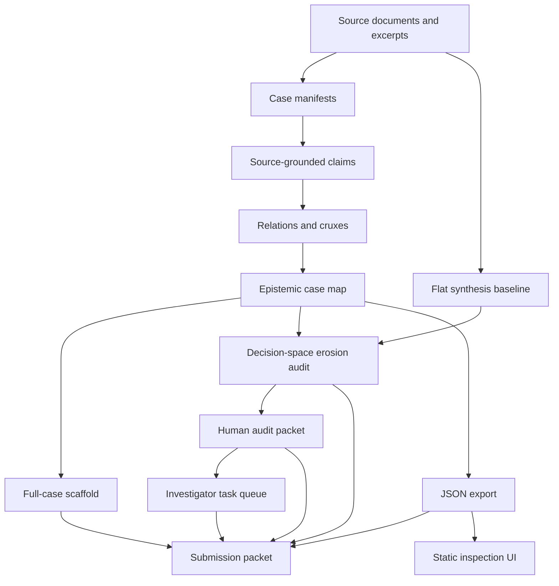

# Prototype Architecture

Status: `human-review-needed`

Purpose: show how the FLF prototype turns sources into reusable, reviewable artifacts.

## Layers

| Layer | Artifact | Purpose |
| --- | --- | --- |
| Ingestion | `data/cases/*/case.yaml`, source text, source inventories | Fix the source subset and provenance. |
| Structure | worked-region maps in `examples/*/worked_region_*.md` | Preserve claims, caveats, relations, cruxes, and similar-but-not-identical claims. |
| Assessment | erosion audits and blinded baseline audits | Check what flat synthesis preserved, flattened, omitted, or distorted. |
| Compounding | JSON exports and human audit packets | Let another reviewer inspect, revise, or extend the artifact. |
| Full-case navigation | `examples/*/full_case_index.md`, `examples/*/full_case_map.md` | Show how worked-region anchors sit inside broader case-level knowledge bases. |
| Operational realism | `docs/INVESTIGATOR_WORKFLOW_PLAYBOOK.md`, `examples/*/investigator_task_queue.md` | Show how a real investigator continues, reviews, and extends the artifact. |
| UI inspection | `ui/index.html`, `ui/data.json` | Gives judges a polished dashboard over canonical artifacts. |

## Validation Surface

- `scripts/run_flf_demo.py`: one-command demo and validation entry point.
- `scripts/validate_worked_regions.py`: checks curated Markdown worked regions.
- `scripts/validate_blinded_baselines.py`: checks local-model flat baselines.
- `scripts/validate_submission_references.py`: checks judge-facing file and ID references.
- `scripts/validate_full_case_knowledge.py`: checks source coverage in full-case scaffolds.
- `scripts/validate_realism_artifacts.py`: checks operational playbook, realism audit, and task queues.
- `scripts/build_ui_data.py --check`: checks generated UI data is current.
- `scripts/validate_ui.py`: checks the static UI shell and referenced artifacts.
- `scripts/export_worked_region_json.py --check`: checks structured exports.
- `scripts/summarize_submission_artifacts.py --check`: checks artifact count summary.
- `scripts/reproducibility_gate.py --include-worked-regions --include-blinded-baselines`: end-to-end reproducibility gate.
