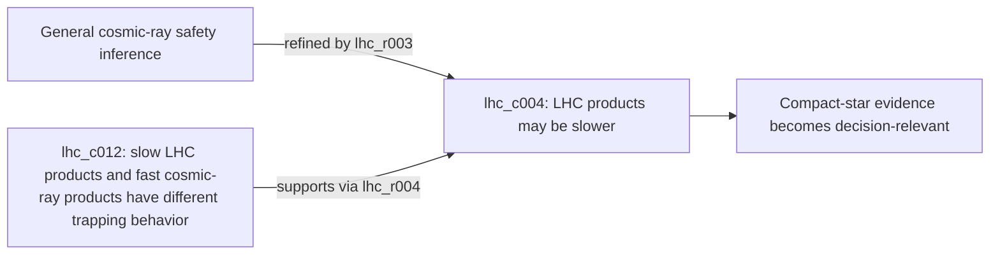

# Proof By Example

Status: `human-review-needed`

## Claim Boundary

The Epistemic Case Mapper is not presented as scientifically validated or as a human-reviewed knowledge base. The evidence offered here is narrower and directly inspectable:

1. a map can preserve a load-bearing distinction that a fluent synthesis makes difficult to audit;
2. the same artifact shape can preserve different kinds of distinctions across three case shapes;
3. blinded synthesis outputs show that preservation in prose is brittle and model-dependent;
4. stable IDs and validators make local extension and some failures visible without restarting the investigation.

Judges should evaluate these claims by inspecting the linked artifacts and running the checks below.

## Best Current Use

The prototype is best used as an epistemic debugger and handoff layer after a bounded investigation has assembled a serious source packet or a capable Deep Research-style answer.

```text
Source packet or research answer
        -> structured claims, relations, caveats, and cruxes
        -> adversarial follow-up questions
        -> local review or correction
        -> held-out or newly arriving source update
        -> regenerated reader-facing view
```

It should not be judged primarily as a better prose generator. Its strongest question is whether another investigator can see what an answer depends on, what it flattened, how to challenge it, and how to update it without starting over.

The implementation plan for turning this use into an empirical judge demonstration is `docs/plans/INVESTIGATOR_CHALLENGE_DEMONSTRATION_PLAN.md`.

## Demonstration 1: A Correct Conclusion Can Hide Its Dependency

Question: does natural cosmic-ray exposure rule out dangerous LHC-produced microscopic black holes?

A capable blinded synthesis gives the broadly correct answer: natural collisions, theoretical decay, and compact-star evidence jointly make catastrophic risk negligible. It even mentions caveats. What it does not leave as a reviewable inference chain is why Earth-survival evidence needs additional work.

The map preserves that chain as separate objects:



- `lhc_c004` anchors the caveat to the LSAG statement that LHC products tend to have lower velocities than cosmic-ray products.
- `lhc_c012` anchors the trapping mechanism to Giddings and Mangano's distinction between relativistic cosmic-ray products and non-relativistic LHC products.
- `lhc_r003` says the velocity difference refines the broad cosmic-ray analogy.
- `lhc_r004` says the technical trapping analysis supports the velocity caveat.

Judge check:

1. Read the blinded [Qwen synthesis](../examples/lhc_black_holes/blinded_flat_synthesis_baseline_qwen3_8b.md).
2. Search it for `velocity`, `slow`, and `trapping`.
3. Inspect `lhc_c004`, `lhc_c012`, `lhc_r003`, and `lhc_r004` in the [LHC map](../examples/lhc_black_holes/worked_region_cosmic_ray_map.md).
4. Decide whether the map makes the dependency easier to inspect, challenge, or revise.

What this establishes: structured claims and relations can expose a dependency that is not reliably available as an audit surface in otherwise capable prose.

What it does not establish: that every map relation is correct, that every synthesis loses this dependency, or that the map is faster to review.

## Demonstration 2: A Stronger Baseline Narrows The Claim Rather Than Defeating It

The eggs case is deliberately harder for the prototype. The strongest blinded synthesis already preserves the major observational-versus-randomized distinction, population heterogeneity, and a moderate-intake conclusion. This is useful: the comparison is not against a straw-man summary.

The map adds stable handles for distinctions that remain easy to merge:

| Review question | Map surface |
| --- | --- |
| Why do BMJ and JAMA appear to disagree? | `eggs_c008`, `eggs_c012`, and `eggs_r003` keep the null moderate-intake result and positive dose-response association in explicit tension. |
| Does randomized evidence measure the decision outcome? | `eggs_c015` and `eggs_r005` state that the RCT evidence concerns lipid markers, not long-term cardiovascular events. |
| Can biomarker worsening coexist with null outcome associations? | `eggs_r006` preserves that tension instead of forcing one evidence family to replace the other. |
| How strong is the umbrella conclusion? | `eggs_c019` and `eggs_r014` preserve that the NNR artifact is a scoping review rather than a de novo qualified systematic review. |
| What does “up to one egg per day” cover? | `eggs_c011` keeps the low typical cohort intake visible; `eggs_c009` keeps regional and diabetes heterogeneity visible. |

Judge check:

1. Read the blinded [Qwen synthesis](../examples/eggs/blinded_flat_synthesis_baseline_qwen3_8b.md).
2. Inspect the named objects in the [eggs map](../examples/eggs/worked_region_observational_vs_rct_map.md).
3. Decide which distinctions the synthesis preserves clearly, preserves only in prose, or omits.

What this establishes: a good synthesis can preserve much of the answer while a map still provides a more local and explicit disagreement surface.

What it does not establish: that the mapped workflow produces a better standalone nutrition answer. The current decision memo remains weaker than the saved Deep Research baseline on quantitative and subgroup synthesis.

## Demonstration 3: Preserve Disagreement Without Pretending To Settle It

The narrow COVID slice tests a different behavior. It represents:

- the judged debate result (`covid_c005`);
- the losing participant's continued substantive disagreement (`covid_c006`);
- a process critique that narrows what the participant concedes (`covid_c007`, `covid_r003`);
- the aggregate superforecast (`covid_c009`) and minority disagreement (`covid_c010`, `covid_r005`);
- update triggers (`covid_c011`);
- a large Bayesian estimate (`covid_c015`) together with its working-paper status (`covid_c016`, `covid_r010`);
- a later phylogenetic subargument and the boundary preventing it from becoming a whole-case conclusion (`covid_c017`, `covid_c018`, `covid_r011`).

Judge check: inspect the [COVID disagreement map](../examples/covid_origins_slice/worked_region_bayesian_disagreement_map.md) and decide whether the labels help distinguish debate outcome, evidence, method critique, forecast distribution, source status, and update conditions.

What this establishes: the format can represent several loci of disagreement without converting them into a false consensus.

What it does not establish: an adjudication of COVID origins. This is a narrow, partly note-grounded stress test and is the least substantively validated of the three regions.

## Runnable Experiments

Run the compact evidence check:

```bash
PYTHONPATH=src python3 scripts/run_proof_by_example.py
```

It performs seven clean-control checks and one expected-failure probe:

| Experiment | Evidence produced | Interpretation |
| --- | --- | --- |
| Worked-region validation | Checks source IDs, excerpts, entailment fields, relation rationales, cruxes, and erosion-audit structure. | The checked-in maps satisfy the declared artifact contract. |
| Eight blinded baselines | Validates four local-model baselines for LHC and four for eggs, produced without access to the curated maps or erosion audits. | Prose preservation varies by model; comparison is not tied to one baseline. |
| Structured exports | Confirms the Markdown maps and reusable JSON exports agree. | The artifacts are not trapped in a narrative-only format. |
| New-source update | Validates the addition of two new-to-map claims and two relations using stable IDs. | A source can be integrated locally without rewriting the existing map. |
| Reference and judge-path checks | Confirms that judge-facing pointers resolve. | The evidence packet is navigable from a fresh checkout. |
| Invalid-source mutation | Changes one claim's source ID in a temporary artifact and requires the validator to reject it with the claim ID and invalid source ID. | At least this provenance failure becomes visible rather than silently entering polished output. |

The runner writes `artifacts/proof_by_example/latest/proof_by_example_run.json` and `PROOF_BY_EXAMPLE_RUN.md`, including commands, return codes, diagnostics, and observed runtimes. Runtimes are operational observations, not performance benchmarks.

For the full package check:

```bash
PYTHONPATH=src python3 scripts/run_flf_demo.py --skip-build
PYTHONPATH=src python3 scripts/reproducibility_gate.py \
  --include-worked-regions \
  --include-blinded-baselines
```

## Multi-Model Comparison

The [multi-model blinded audit](review/MULTI_MODEL_BLINDED_BASELINE_AUDIT.md) compares Gemma, Qwen, Phi, and Granite outputs on the same source spans. Different models preserve different details:

- Qwen produces the most detailed flat output but still does not make the LHC low-velocity trapping dependency explicit and reviewable.
- Gemma preserves the major eggs endpoint distinction, forcing several initial erosion claims to be narrowed or rejected.
- Phi's concise output loses more of the decision structure.
- Granite retains some source-specific detail while flattening the critique/response and evidence-role structure.

This is an agent-authored qualitative audit, not a human score. Its strongest implication is methodological: a map plus erosion audit lets a reviewer identify exactly where a baseline preserved, flattened, omitted, or distorted a distinction. The result is allowed to narrow the project's claim.

## Direct Answers To The Four Judge Questions

### Would this help someone reason better?

Demonstrated narrowly: the LHC example exposes a hidden dependency; eggs exposes endpoint and evidence-role boundaries; COVID exposes loci of disagreement and update triggers. Whether these surfaces improve real reviewer accuracy or speed remains unmeasured.

### Does it generalize?

The same schema and validators operate across a closed technical-risk case, a heterogeneous health-evidence case, and a narrow adversarial disagreement. No independent second operator or unseen-case build has yet demonstrated transfer beyond the authors' selected regions.

### Does it scale with better AI or more compute?

The workflow decomposes extraction, relation proposal, crux identification, synthesis, stress testing, and review into bounded stages, so stronger models or additional passes can be substituted locally. Current high-quality maps still depend materially on curation; hands-free quality is not demonstrated.

### Does it compound?

Stable IDs, Markdown/JSON exports, resumable stages, task queues, and the new-source update demo provide concrete extension surfaces. Multi-reviewer conflict resolution and measured second-operator handoff remain unfinished.

## Bottom Line

The proof offered is not “the system is correct because its tests pass.” It is:

> Here are specific reasoning distinctions, here is how ordinary model prose handled them, here is how the map preserves them, and here are the exact artifacts and commands a judge can use to disagree.

That is sufficient to evaluate the prototype's present contribution while keeping its unproven claims visible.
