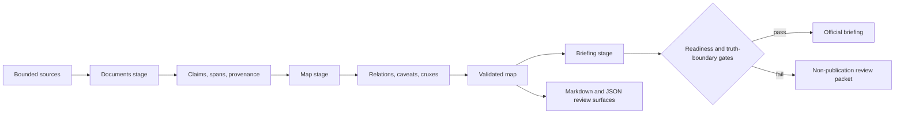

# Architecture

Status: `implemented-core`

The reusable engine has three layers:

1. Package config: `submission_manifest.yaml` or another manifest passed with `--manifest` / `--package`.
2. Engine code: shared infrastructure in `src/epistemic_case_mapper/`, ordered stage code under `src/epistemic_case_mapper/pipeline/`, and script entry points under `scripts/`.
3. Package artifacts: case manifests, source files, worked maps, audits, baselines, review docs, exports, and UI data.

The case is the source-corpus unit. The worked region is the operational unit for validation, JSON export, review selection, baseline prompts, and UI anchors.

The important boundary is that prose is a view over the
structured artifact, not the sole record of the investigation:



## Execution Stages

The package layout follows the three persisted handoffs exposed by `ecm`:

```text
documents -> map -> briefing
```

| Stage package | Owns | Produces for the next stage |
| --- | --- | --- |
| `pipeline/documents/` | Source filtering, case initialization, and evidence-bundle preparation | A bounded document/source packet with provenance |
| `pipeline/map/` | Claim extraction and normalization, relation construction, map quality checks, repair, and map output | A validated epistemic map and map-stage telemetry |
| `pipeline/briefing/` | Decision-ready context, decision model and packet construction, section synthesis, validation, and publication | A briefing, supporting artifacts, telemetry, and final review packet |

The conceptual mechanism chain—retrieval gate, claim normalization,
decision-space construction, judgment anchors, artifact fidelity, and auditable
authority—runs across these three execution stages. It does not create six
separate persistence boundaries.

Shared schemas, I/O, configuration, model backends, prompt utilities, and the
CLI remain at `src/epistemic_case_mapper/`. Minimal root facades preserve the
existing import and command surfaces while stage implementations use explicit
`epistemic_case_mapper.pipeline.<stage>...` imports. Stage `__init__.py` files
must remain free of eager re-exports so later-stage dependency graphs are not
initialized by importing an earlier stage.

`ecm` is the package-facing command. `scripts/ecm.py` remains a compatibility wrapper. It can run against an external package root:

```bash
PYTHONPATH=src python3 scripts/ecm.py --repo-root /tmp/package validate package
```

Use `ecm package prepare` to generate product-facing assets for an arbitrary package: `ui/data.json`, the reusable static UI shell, a Tier 1 checklist, and `docs/review/REVIEWER_START_HERE.md`.

Use `ecm quality init --case <case_slug> --title "<title>" --question "<question>"` to create the unseen-case quality review packet under `docs/unseen_case_tests/<case_slug>/`. After completing the protocol, scorecard, quality review, and baseline comparison, use `ecm quality gate --case <case_slug>` to regenerate package-facing assets, run the package validators, check export/UI/review freshness, and validate the completed quality documents.

Quality signals flow into generated artifacts. Source provenance metadata and unseen-case scorecards produce reviewer-start warnings, UI quality warnings, and `GENERATED_RISK_TASKS.md` follow-up tasks.

## Publication Boundary

The briefing stage fails closed. Unsupported polish additions, invalid source
bindings, missing mandatory evidence, unresolved human-review dependencies,
citation failures, and inconclusive quality gates prevent an output from being
published as the official `BRIEFING.md`. The run still retains an inspectable
packet so a reviewer can diagnose and repair the failure. Passing mechanical
gates establishes internal consistency, not substantive human review.

For model-assisted semantic work, use `ecm semantic prompt map`, `ecm semantic prompt critique`, `ecm semantic validate map`, and `ecm semantic validate critique`. This keeps LLM work on candidate claims, relations, cruxes, and critiques while deterministic code owns source-bounded prompt construction, source/excerpt checks, relation ontology checks, and package gates.

The current project package is configured by `submission_manifest.yaml`.
