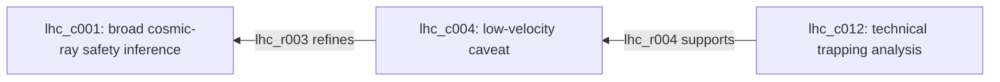

# Epistemic Case Mapper

Status: competition writeup, prepared 2026-07-19

## The problem

AI-assisted research usually ends as prose. That is useful for reading, but weak
for review and handoff. A report can reach the right conclusion while making it
hard to recover:

- which source supports each claim;
- whether a statement came from a source or from the synthesizer;
- which caveat limits an inference;
- whether two studies disagree or merely examine different populations or
  endpoints;
- which premise carries the conclusion; and
- what could be corrected locally when new evidence arrives.

This is **reasoning-structure loss**: the conclusion survives, but some of the
claims, dependencies, disagreements, or scope conditions needed to inspect it do
not. The practical cost appears later. A reviewer or second investigator must
reconstruct the argument from prose before they can challenge, update, or reuse
the work.

Epistemic Case Mapper addresses this problem by treating prose as a view over a
durable research artifact rather than as the sole record of the investigation.
It turns a bounded source packet into stable, source-linked claims, typed
relations, caveats, and cruxes that can be inspected and revised individually.
The strongest examples in this submission are curated demonstrations of that
artifact protocol; separate live runs test how well the automated pipeline can
produce the same kind of artifact.

Citations and argument graphs can each preserve part of the needed structure.
The mapper's contribution is the integrated artifact protocol: exact source
spans, typed dependencies, deterministic validation, local review state,
retained model failures, and update obligations remain connected in portable
artifacts that another investigator can reuse.

## One concrete example

Consider the safety argument about microscopic black holes at the Large Hadron
Collider. Natural cosmic-ray collisions have occurred at or above LHC energies
without destroying Earth or other astronomical bodies. A fluent synthesis can
therefore reach the broadly correct conclusion that catastrophic risk is
negligible.

But Earth-survival evidence has a load-bearing qualification: products created
at the LHC may be slower and easier to trap than products created by cosmic
rays. If fast cosmic-ray products pass through Earth while slower collider
products can be captured, Earth survival is not sufficient by itself. Technical
trapping analysis and evidence from dense astronomical bodies then become
important parts of the safety case.

The mapper preserves this dependency as addressable objects:



The central comparison is directly visible in the artifacts:

| Surface | What it preserves |
| --- | --- |
| Blinded synthesis | The broad conclusion: cosmic-ray and compact-star evidence "rules out decision-relevant risks," subject to caveats. |
| Missing audit surface | It does not explicitly state that lower-velocity LHC products may be trapped when relativistic cosmic-ray products are not. |
| `lhc_c004` | LSAG source excerpt: LHC products "will tend to have low velocities," unlike high-velocity cosmic-ray products. |
| `lhc_c012` | Source-grounded claim: Earth cannot stop a highly relativistic cosmic-ray product, while a non-relativistic LHC product can slow. |
| `lhc_r003` and `lhc_r004` | The trapping analysis supports the velocity caveat, which refines the broad cosmic-ray inference. |

The blinded [Qwen synthesis](../../examples/lhc_black_holes/blinded_flat_synthesis_baseline_qwen3_8b.md)
reaches the broad safety conclusion and includes several caveats, but it does
not preserve this low-velocity trapping chain as an explicit review surface.
The [LHC map](../../examples/lhc_black_holes/worked_region_cosmic_ray_map.md)
does. This does not prove that strong models cannot recover the dependency. It
shows the narrower value of the artifact: another investigator does not have to
re-derive the dependency from prose before inspecting or revising it.

## How the mapper addresses it

The workflow has three core operations.

### 1. Ground claims in a declared source boundary

An investigation begins with a question and a bounded set of documents. Each
source receives a stable identifier and provenance record. For realistic source
packets, documents are divided into source-local spans. A model may select spans
and propose claim classifications, but deterministic code supplies the exact
source ID, span, and excerpt. Unknown spans, malformed objects, and unsupported
references are rejected and logged.

### 2. Preserve relationships, caveats, and cruxes

Claims remain separate objects instead of being blended immediately into prose.
Typed relations record whether one claim supports, challenges, refines, depends
on, or stands in tension with another. Open questions and cruxes record what is
unresolved and what evidence could change the assessment. Stable IDs let a
reviewer accept, reject, or revise one object without rewriting the whole case.

### 3. Validate and hand off the artifact

Deterministic validators check schema conformance, exact excerpt recovery,
source membership, relation endpoints, artifact freshness, and package
references. The same map is exported as readable Markdown and reusable JSON.
Review packets, task queues, warnings, and model-call records expose unresolved
work. Optional synthesis stages can write from the accepted map, with retention
checks for mandatory evidence, quantities, scope conditions, and citations.

The result is not a truth machine. It is a structured boundary around model
judgment: models propose semantic interpretations, code enforces mechanical
constraints, and people remain responsible for substantive correctness.

## What the evidence establishes

The repository contains several kinds of evidence. They should not be treated
as interchangeable.

| Evidence surface | What it demonstrates | What it does not demonstrate |
| --- | --- | --- |
| Curated LHC and eggs maps | The artifact protocol can preserve source-linked dependencies, evidence roles, caveats, and disagreement across two different case shapes. | Reliable autonomous map generation or expert-approved domain correctness. |
| Eight blinded local-model syntheses | The agent-authored audit indicates that prose preservation varies across Gemma, Qwen, Phi, and Granite, while the map provides a stable comparison surface. | A human-scored benchmark or superiority over top-range deep research. |
| Paired live Gemma MLX runs | The production mapper can retain a candidate that passes its artifact checks and can reject an invalid result while preserving its failure trail. | Consistent hands-free production quality or domain correctness from a local 12B model. |
| Deterministic validators and replay exercises | Provenance faults, invalid relations, stale artifacts, and some local changes can be detected or accounted for mechanically. | Semantic truth, corpus completeness, or correct relation judgment. |
| COVID-origins slice | The format can keep several loci of disagreement distinct. | Source-grounded adjudication of COVID origins. |

### Primary proof: inspectable dependencies

The LHC example is the clearest demonstration. The mapped caveat and trapping
analysis are source-linked, separately reviewable, and connected to the broad
safety inference. Four blinded local-model baselines preserve different subsets
of the case. The claim is not that every synthesis fails. It is that preservation
in prose is model-dependent, while the structured dependency remains directly
addressable.

The compact [Proof By Example](PROOF_BY_EXAMPLE.md) provides the comparison and
runnable checks. The [multi-model audit](../review/MULTI_MODEL_BLINDED_BASELINE_AUDIT.md)
records where Gemma, Qwen, Phi, and Granite preserved, flattened, omitted, or
distorted distinctions. That audit is agent-authored and still requires human
review; its value is the item-level comparison surface, not an accuracy score.

### Transfer proof: different evidence roles

The [eggs and cardiovascular-health map](../../examples/eggs/worked_region_observational_vs_rct_map.md)
tests a different kind of case. It keeps long-term observational outcomes
separate from randomized effects on lipid markers, guideline interpretations,
replacement context, baseline intake, regional heterogeneity, and high-risk
subgroups. This matters because a biomarker result, a population association,
and a policy recommendation can all be relevant without being interchangeable.

The strongest blinded eggs synthesis already preserves many major distinctions.
That narrows rather than defeats the project claim: a good answer can remain good
prose while stable claim and relation IDs provide a more local surface for
checking endpoints, scope, and disagreement.

### Machinery proof: visible success and failure

The [paired live Gemma MLX packet](../../examples/live_model_runs/README.md)
records two runs of the production mapper using the same
`ollama:gemma4:12b-mlx` backend. The eggs run produced a 26-claim, 22-relation
candidate that passed the pipeline's semantic artifact checks and was rated
`usable_with_review`; it remains `human-review-needed`, and retained diagnostics
still flag excess claims, near-duplicates, and skipped chunks. The LHC run
encountered two backend timeouts and produced one claim with no relations or
cruxes. Its attempted repair failed schema and coverage checks, so the pipeline
retained the prompts, raw outputs, repair trail, and non-publication evidence.

This pair is not the primary epistemic proof. It demonstrates that the
production machinery can create a reviewable candidate and, equally
importantly, make a failed run visible instead of presenting it as a polished
answer.

## Why this can support compounding work

The intended user is an investigator inheriting, reviewing, or extending an
existing body of research. Stable objects change the handoff from "read this
report and reconstruct its reasoning" to "inspect these claims, relations, and
open questions, then record local decisions."

That design supports several forms of compounding:

- a reviewer can challenge one relation while leaving accepted claims intact;
- a new source can add or revise local objects without replacing the complete
  narrative;
- different models can be compared against the same declared structure;
- downstream writers can receive explicit evidence and retention obligations;
- rejected model outputs and unresolved review tasks remain inspectable; and
- Markdown, JSON, and CSV artifacts can be reused without an opaque application
  database.

The current repository demonstrates addressability and local change accounting
through the [investigator challenge](../../examples/investigator_challenge/README.md),
which includes frozen-snapshot restoration and a prewritten source-delta replay.
Those exercises do not demonstrate autonomous source reading or semantic repair.
A future independent-review study must establish whether the structure actually
improves reviewer accuracy, speed, or update quality.

## Implementation and reproducibility

Epistemic Case Mapper is a Python 3.11 package with an `ecm` command-line
interface. It supports local command backends and Ollama models. Prompts,
intermediate artifacts, validation results, and non-publication diagnostics are
retained for inspection.

After installing the development dependencies described in
[REPRODUCE.md](REPRODUCE.md), the deterministic judge path calls no model:

```bash
PYTHONPATH=src python3 scripts/run_flf_demo.py --skip-build
PYTHONPATH=src python3 scripts/reproducibility_gate.py \
  --include-worked-regions \
  --include-blinded-baselines
```

Passing these checks establishes package integrity, artifact consistency, and
selected local-edit behavior. It does not establish scientific correctness.

## Limitations

The strongest maps are agent-curated from source excerpts and marked
`human-review-needed`. No completed independent expert review establishes that
their claims were atomized correctly, their relations were labeled correctly,
or their source packets were balanced. A faithful map of a biased corpus can
still mislead.

Mechanical validation is strongest at internal consistency and weakest at
completeness. A model or curator can omit a decisive perspective before a
validator sees it. Relation labels also carry interpretation: calling a claim a
challenge, dependency, or crux can assert more than its source warrants.

The evaluation base is small and partly selected because it demonstrates the
method well. No second operator has independently built a fresh case. The
blinded comparisons are qualitative and agent-audited, not a paper-grade human
benchmark. The live Gemma pair shows that automation can still fail severely.

The optional decision-memo layer is provisional. Its gates expose missing
writer obligations, but no current memo run is part of the curated contest
evidence. The submission therefore claims inspectable stage contracts and
controlled handoff, not superior final prose.

The full claim ledger is in [Evidence And Limitations](EVIDENCE_AND_LIMITATIONS.md).

## Bottom line

Epistemic Case Mapper changes what is retained from an AI-assisted
investigation. Instead of leaving only a readable answer, it preserves
source-linked claims, dependencies, caveats, disagreements, and review
obligations as durable objects.

The repository demonstrates that this artifact protocol is technically workable
across distinct case shapes, that it can make a load-bearing dependency easier
to inspect than prose alone, and that its production pipeline can retain both a
reviewable model output and an explicit failure. It does not yet demonstrate
independent domain correctness or measured reviewer uplift.

For a short evaluation, start with the [curated judge path](../START_HERE.md),
then inspect [Proof By Example](PROOF_BY_EXAMPLE.md) and run its deterministic
checks. Those artifacts present the strongest current case: preserving reasoning
structure gives later investigators something concrete to inspect, contest, and
extend without reconstructing the investigation from scratch.
